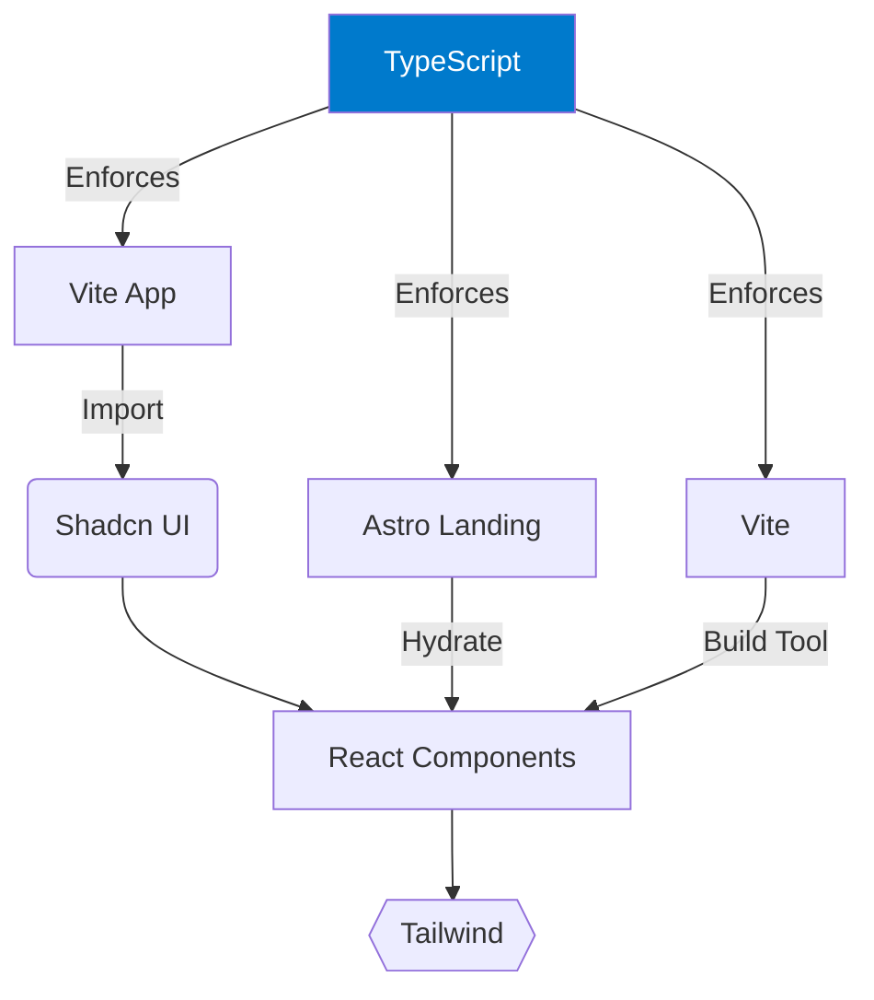

# Nebula Architectural Constitution

## Multi-Framework Architecture



### Core Integration Points
1. Shared `@nebula-ui` package contains:
   - TypeScript type definitions
   - Tailwind config presets
   - Shadcn UI component registry (embedded Storybook examples below)

```html
<!-- Embedded Storybook component -->
<iframe src="/storybook/index.html?path=/story/example-button--primary" width="100%" height="300px"></iframe>

// See Storybook Setup in ONBOARDING.md for component development
```
2. Vite/React handles:
   - Admin dashboard
   - Complex interactive components
3. Astro manages:
   - Marketing site
   - Static content
   - SEO optimizations

## Eternal Stack

## File Structure Law
```bash
# Violators will be spaced!
/src
  /app          # App Router ONLY
  /components   # Reusable components
  /lib          # Shared utilities
```

## Core Principles
- TypeScript-first development
- Microservices architecture
- CI/CD pipeline integration

## Architecture Decision Records
- ADR-001: TypeScript Migration Strategy
- ADR-002: CI/CD Pipeline Implementation
- ADR-003: Containerization Approach
