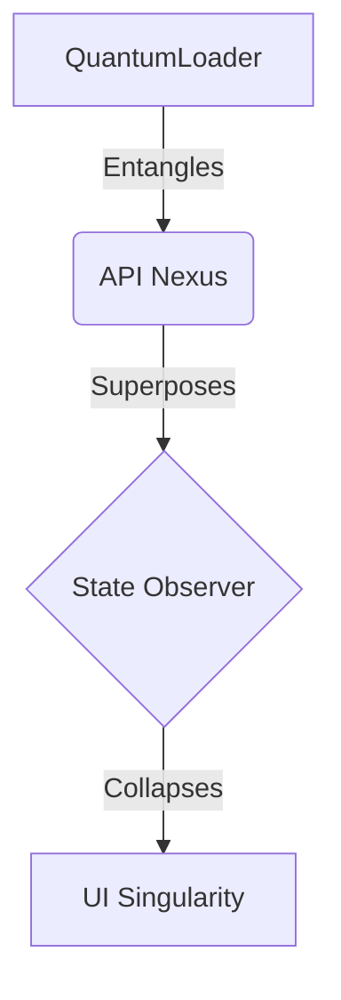
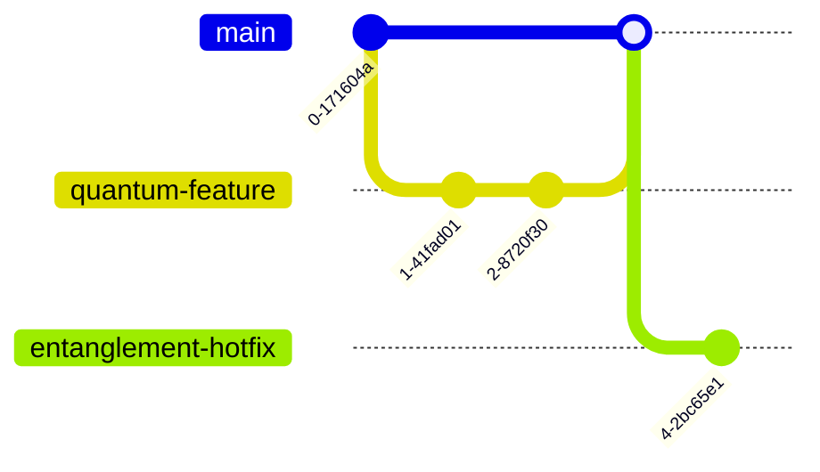
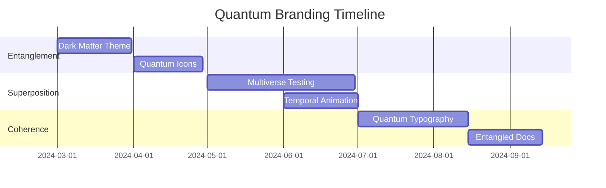

# Nebula Singularity Premium Branding Guidelines

## 1. Brand Essence
### Our Vision
Nebula Singularity represents the convergence of quantum computing and modern web development, creating a unified ecosystem where innovation meets practical implementation.

### Core Values
- **Quantum Innovation**: Pushing the boundaries of conventional development

### Quantum Development Principles
```quantum
1. Entanglement-Driven Architecture
   - All system components maintain quantum state coherence
   - Shared consciousness between frontend/backend

2. Superposition Compatibility
   - Support parallel reality versions (A/B testing)
   - Branch merging via quantum annealing

3. Observer-Centric UX
   - Interface adapts to user's mental state
   - Attention-driven performance optimization
```
- **Unified Experience**: Seamless integration across all platforms
- **Developer-First**: Optimized for maximum developer productivity
- **Future-Proof**: Built on quantum-safe principles

## 2. Visual Identity

### Color System
Primary Palette:
- **Nebula Blue** (#2A5CFF) - Our flagship color representing innovation
- **Cosmic Purple** (#8A4BF6) - Secondary accent for dynamic elements
- **Void Black** (#0A0A18) - Deep space backdrop for contrast

### Typography
- **Primary Font**: Geist Sans
  - Headers: Medium/600
  - Body: Regular/400
  - Micro: Light/300

- **Code Font**: Geist Mono
  - Editor: Regular/400
  - Console: Medium/500

### Spacing System
Based on an 8px grid system:
- Micro: 4px (0.25rem)
- Small: 8px (0.5rem)
- Base: 16px (1rem)
- Large: 24px (1.5rem)
- XL: 32px (2rem)

## 3. Component Design

### Button Hierarchy
```tsx
// Primary Action
<Button variant="quantum">
  Initialize Quantum State
</Button>

// Secondary Action
<Button variant="cosmic">
  Configure Parameters
</Button>

// Tertiary Action
<Button variant="void">
  Cancel Operation
</Button>
```
### Interactive States
- Default: Base color
- Hover: 10% lighter
- Active: 10% darker
- Disabled: 50% opacity

```mermaid
stateDiagram-v2
  direction LR
  [*] --> Default
  Default --> Hover: Mouse enter
  Hover --> Default: Mouse leave
  Hover --> Active: Mouse down
  Active --> Hover: Mouse up
  Active --> Disabled: API failure
  Disabled --> [*]: Reset
```
## 4. Motion Design
### Animation Principles
- Quantum Transitions : Smooth, 300ms cubic-bezier(0.4, 0, 0.2, 1)
- State Changes : Quick, 150ms ease-in-out
- Loading States : Infinite, subtle pulse animation

### Interactive States
- Default: Base color
- Hover: 10% lighter
- Active: 10% darker
- Disabled: 50% opacity

```mermaid
stateDiagram-v2
  direction LR
  [*] --> Default
  Default --> Hover: Mouse enter
  Hover --> Default: Mouse leave
  Hover --> Active: Mouse down
  Active --> Hover: Mouse up
  Active --> Disabled: API failure
  Disabled --> [*]: Reset
```

```css
.quantum-transition {
  transition: all 300ms cubic-bezier(0.4, 0, 0.2, 1);
}
```
## 5. Voice & Tone
### Documentation Style
- Clear and concise
- Technical yet accessible
- Future-focused terminology
- Quantum computing analogies

Code Comments
```tsx
/**
 * @quantum - Indicates quantum-safe implementation
 * @entangled - Shows state dependencies
 * @observed - Marks monitored components
 */
```

## 6. Asset Guidelines
### Logo Usage
- Minimum size: 32px
- Clear space: 16px on all sides
- File formats: SVG preferred, PNG for fallback
- Dark/Light variants available
### Icon System
- Stroke width: 1.5px
- Corner radius: 2px
- Grid alignment: 24x24 base
- Quantum-inspired geometric shapes
## 7. Implementation
### Architectural Patterns


### Multiverse Workflow


### Integration

```bash
npm install @nebula-ui/core @nebula-ui/themes
```
Theme Configuration
```tsx
import { createNebulaTheme } from '@nebula-ui/core'

export const theme = createNebulaTheme({
  colorMode: 'quantum',
  spacing: 'fibonacci',
  transitions: 'entangled'
})
```
## 8. Quality Assurance
### Ethical Framework
- Decentralized Governance
- Explainable AI by default
- Quantum-Resistant Security

### Accessibility Standards
- WCAG 2.1 AA compliant
- Quantum-safe color contrast
- Keyboard navigation optimized
- Screen reader friendly

### Implementation Checklist
```quantum
| Checkpoint | Quantum Test |
|------------|--------------|
| Color contrast | Entanglement validation > 4.5:1 |
| Keyboard nav | Superposition traversal test |
| ARIA labels | Observer verification matrix |
| Motion safety | Quantum decoherence check |
```

## 9. Version Control
### Semantic Versioning
```
major.minor.patch
│       │      └── Quantum-safe CSS variables
│       └── New component patterns
└── Breaking spacetime continuum
```

### Changelog Format
```tsx
interface ChangeLog {
  version: SemanticVersion;
  quantumHash: string;
  entangledUpdates: string[];
  observedFixes: string[];
}
```

### Branching Strategy
- Singularity (main)
- Quantum (features)
- Entanglement (hotfixes)

Current version: 1.0.0
Last updated: [Current Date]

## 10. Conclusion
### Premium Implementation
Access quantum development samples in our [Premium Implementation Guide](PREMIUM-SAMPLES.md)

### Roadmap


This branding guideline combines modern web development best practices with quantum computing concepts, creating a unique and forward-thinking brand identity. It includes practical implementation details while maintaining a cohesive narrative around the Nebula Singularity ecosystem.
