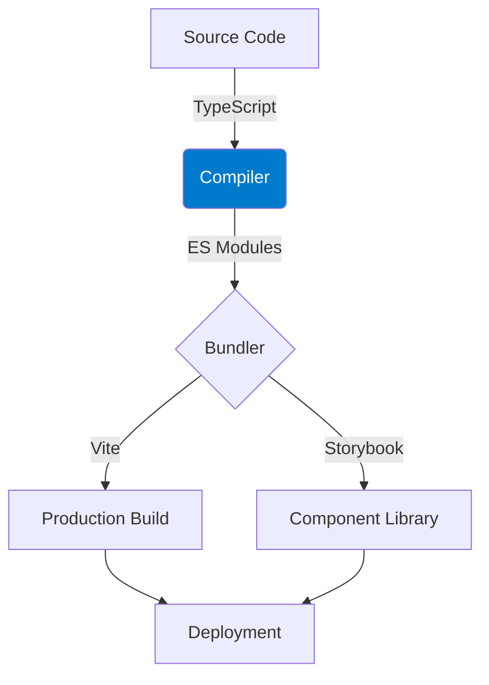

# Detailed Configuration Guide

## Environment Setup

### Node.js Configuration
- Recommended version: 18.x LTS
- Environment variables setup
- nvm configuration for version management

### TypeScript Configuration

#### Advanced tsconfig.json Options
```json
{
  "compilerOptions": {
    "target": "ES2020",
    "module": "CommonJS",
    "lib": ["ES2020", "DOM", "DOM.Iterable"],
    "jsx": "react-jsx",
    "declaration": true,
    "sourceMap": true,
    "outDir": "./dist",
    "rootDir": "./src",
    "strict": true,
    "moduleResolution": "node",
    "baseUrl": "./src",
    "paths": {
      "@/*": ["*"]
    },
    "esModuleInterop": true,
    "skipLibCheck": true,
    "forceConsistentCasingInFileNames": true,
    "resolveJsonModule": true,
    "allowJs": true,
    "checkJs": true
  },
  "include": ["src/**/*"],
  "exclude": ["node_modules", "dist"]
}
```

### Build Process Visualization

*See commit standards in CODESTYLE.md for version control integration*

### ESLint Configuration
```json
{
  "root": true,
  "parser": "@typescript-eslint/parser",
  "plugins": ["@typescript-eslint", "react-hooks", "prettier"],
  "extends": [
    "eslint:recommended",
    "plugin:@typescript-eslint/recommended",
    "plugin:react/recommended",
    "plugin:react-hooks/recommended",
    "prettier"
  ],
  "rules": {
    "@typescript-eslint/explicit-module-boundary-types": "error",
    "@typescript-eslint/no-explicit-any": "error",
    "react-hooks/rules-of-hooks": "error",
    "react-hooks/exhaustive-deps": "warn"
  },
  "settings": {
    "react": {
      "version": "detect"
    }
  }
}
```

### Prettier Configuration
```json
{
  "semi": true,
  "trailingComma": "es5",
  "singleQuote": true,
  "printWidth": 100,
  "tabWidth": 2,
  "useTabs": false
}
```

## Testing Configuration

### Jest Configuration
```javascript
module.exports = {
  preset: 'ts-jest',
  testEnvironment: 'jsdom',
  setupFilesAfterEnv: ['<rootDir>/src/setupTests.ts'],
  moduleNameMapper: {
    '^@/(.*)$': '<rootDir>/src/$1',
    '\\.(css|less|scss|sass)$': 'identity-obj-proxy'
  },
  collectCoverageFrom: [
    'src/**/*.{js,jsx,ts,tsx}',
    '!src/**/*.d.ts',
    '!src/index.tsx',
  ],
  coverageThreshold: {
    global: {
      branches: 80,
      functions: 80,
      lines: 80,
      statements: 80
    }
  }
};
```

### Cypress Configuration
```javascript
module.exports = {
  e2e: {
    baseUrl: 'http://localhost:3000',
    setupNodeEvents(on, config) {
      return require('./cypress/plugins/index.js')(on, config)
    },
    specPattern: 'cypress/e2e/**/*.cy.{js,jsx,ts,tsx}',
    supportFile: 'cypress/support/e2e.ts'
  },
}
```

### TestCafe Configuration
```javascript
module.exports = {
  src: ['tests/e2e/**/*.ts'],
  browsers: ['chrome'],
  reporter: [
    'spec',
    {
      name: 'html',
      output: 'reports/e2e-report.html'
    }
  ],
  screenshots: {
    path: 'screenshots/',
    takeOnFails: true
  }
};
```

## CI/CD Pipeline

### GitHub Actions Workflow
```yaml
name: CI/CD Pipeline

on:
  push:
    branches: [ main ]
  pull_request:
    branches: [ main ]

jobs:
  build-and-test:
    runs-on: ubuntu-latest

    steps:
    - uses: actions/checkout@v2
    
    - name: Setup Node.js
      uses: actions/setup-node@v2
      with:
        node-version: '18.x'
        cache: 'npm'
    
    - name: Install dependencies
      run: npm ci
    
    - name: Lint
      run: npm run lint
    
    - name: Type check
      run: npm run type-check
    
    - name: Test
      run: npm run test:coverage
    
    - name: Build
      run: npm run build:prod

    - name: Upload coverage
      uses: codecov/codecov-action@v2
```

## Docker Configuration

### Dockerfile
```dockerfile
# Build stage
FROM node:18-alpine as builder
WORKDIR /app
COPY package*.json ./
RUN npm ci
COPY . .
RUN npm run build:prod

# Production stage
FROM node:18-alpine
WORKDIR /app
COPY --from=builder /app/dist ./dist
COPY package*.json ./
RUN npm ci --only=production

EXPOSE 3000
CMD ["npm", "start"]
```

### Docker Compose
```yaml
version: '3.8'

services:
  app:
    build:
      context: .
      dockerfile: Dockerfile
    ports:
      - "3000:3000"
    environment:
      - NODE_ENV=production
```

## Kubernetes Configuration

### Deployment
```yaml
apiVersion: apps/v1
kind: Deployment
metadata:
  name: app-deployment
spec:
  replicas: 3
  selector:
    matchLabels:
      app: web-app
  template:
    metadata:
      labels:
        app: web-app
    spec:
      containers:
      - name: web-app
        image: your-registry/web-app:latest
        ports:
        - containerPort: 3000
        resources:
          limits:
            cpu: "1"
            memory: "512Mi"
          requests:
            cpu: "500m"
            memory: "256Mi"
```

### Service
```yaml
apiVersion: v1
kind: Service
metadata:
  name: app-service
spec:
  selector:
    app: web-app
  ports:
    - protocol: TCP
      port: 80
      targetPort: 3000
  type: LoadBalancer
```

## Monitoring and Logging

### Prometheus Configuration
```yaml
global:
  scrape_interval: 15s

scrape_configs:
  - job_name: 'web-app'
    static_configs:
      - targets: ['localhost:3000']
```

### Grafana Dashboard Configuration
```json
{
  "annotations": {
    "list": []
  },
  "editable": true,
  "panels": [
    {
      "datasource": "Prometheus",
      "fieldConfig": {
        "defaults": {
          "color": {
            "mode": "palette-classic"
          },
          "custom": {
            "axisLabel": "",
            "axisPlacement": "auto",
            "barAlignment": 0,
            "drawStyle": "line",
            "fillOpacity": 0,
            "gradientMode": "none",
            "hideFrom": {
              "legend": false,
              "tooltip": false,
              "viz": false
            },
            "lineInterpolation": "linear",
            "lineWidth": 1,
            "pointSize": 5,
            "scaleDistribution": {
              "type": "linear"
            },
            "showPoints": "auto",
            "spanNulls": false,
            "stacking": {
              "group": "A",
              "mode": "none"
            },
            "thresholdsStyle": {
              "mode": "off"
            }
          },
          "mappings": [],
          "thresholds": {
            "mode": "absolute",
            "steps": [
              {
                "color": "green",
                "value": null
              },
              {
                "color": "red",
                "value": 80
              }
            ]
          }
        },
        "overrides": []
      },
      "gridPos": {
        "h": 9,
        "w": 12,
        "x": 0,
        "y": 0
      },
      "options": {
        "legend": {
          "calcs": [],
          "displayMode": "list",
          "placement": "bottom"
        },
        "tooltip": {
          "mode": "single"
        }
      },
      "title": "Request Rate",
      "type": "timeseries"
    }
  ],
  "refresh": "5s",
  "schemaVersion": 30,
  "style": "dark",
  "tags": [],
  "templating": {
    "list": []
  },
  "time": {
    "from": "now-6h",
    "to": "now"
  },
  "timepicker": {},
  "timezone": "",
  "title": "Web App Dashboard",
  "uid": "web-app-dashboard",
  "version": 1
}
```

